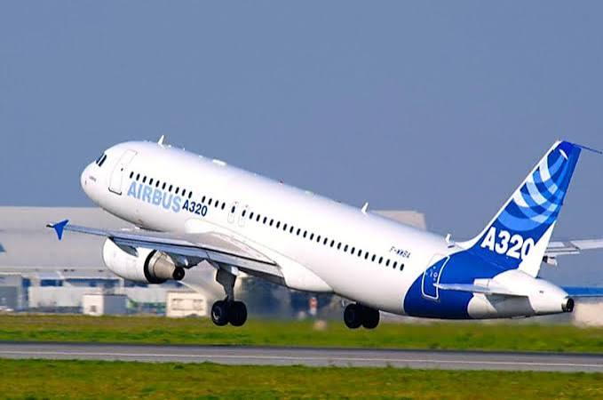

# Los Aviones - Airbus

## ¿Que es Airbus?

*[Airbus](https://www.airbus.com/es/about-us/our-worldwide-presence/airbus-in-europe/airbus-in-spain/airbus-commercial-aircraft-in-spain) es un importante fabricante europeo de aeronaves* y uno de los mayores constructores de aviones y equipos aeroespaciales del mundo.

**Actividad y sectores**

Aviones comerciales: Diseña y fabrica aviones de pasajeros de pasillo único y de doble pasillo (como el A320 o el A350).
Defensa y espacio: Produce aviones militares, satélites y sistemas de seguridad.
Helicópteros: Fabrica aeronaves de ala rotatoria para uso civil, policial y militar a través de su división especializada.

Se fundó a finales de los años 60 como un consorcio europeo impulsado por países como Francia, Alemania, España y el Reino Unido para competir en la industria aeronáutica. Su principal rival a nivel global es la empresa estadounidense Boeing.

## Tipos de Aeronaves 

Airbus cuenta con una gran cantidad de Aeronaves, siendo algunas las siguientes:

| Aeronave | Capacidad | Precio |
|-----|-----------|--------|
| Airbus A220-100 | 100-135 | 81M-$85M |
| Airbus A220-300 | 120-160 | 91M-$93M |
| Airbus A319neo | 120-160 | $104M |
| Airbus A320ceo | 140-170 | $101M |
| Airbus A320neo | 150-194 | $113.5M |
| Airbus A321ceo | 160-230 | $118.3M |
| Airbus A321neo | 185-244 | $132.5M |
| Airbus A321XLR | 180-220 | 140M-$145M |
| Airbus A380-800 | 525-853 | $445M |

## Airbus y sus proyectos

Airbus mantiene una sólida colaboración con la NASA en el sector aeroespacial y lidera el desarrollo de las aeronaves que transformarán la aviación comercial en las próximas décadas. Su enfoque principal combina la exploración del espacio profundo con la creación de aviones ultraeficientes y de cero emisiones.

**Proyectos Actuales con la NASA**

La alianza entre Airbus y la NASA no se centra en aviones comunes, sino en tecnologías de frontera espacial y monitorización global:

- Programa Artemis (Módulos ESM): Airbus es el contratista principal que diseña y fabrica el European Service Module (ESM) para la nave espacial Orion de la NASA. Este módulo proporciona la propulsión, energía, agua y oxígeno esenciales para que los astronautas regresen a la Luna.

- Estación Espacial Starlab: Airbus se ha asociado con entidades estadounidenses para diseñar Starlab, una estación espacial comercial de próxima generación que servirá como uno de los relevos de la Estación Espacial Internacional (ISS) cuando esta sea retirada.

- Misión Climática GRACE-C: En colaboración directa con la NASA y la agencia alemana (DLR), Airbus está construyendo los satélites de la misión GRACE-C, diseñados para medir las variaciones de la gravedad terrestre y monitorizar el deshielo y el agua subterránea debido al cambio climático.

**Aeronaves del Futuro en Desarrollo (Aviation 2030 - 2050)**

En el área de aviación comercial, Airbus trabaja en proyectos disruptivos para sustituir a sus familias actuales mediante tres grandes pilares tecnológicos:

- El Sucesor del A320neo (Proyecto de Corto/Medio Alcance)Airbus está sentando las bases tecnológicas para lanzar formalmente un avión de pasillo único completamente nuevo entre 2030 y 2031, con entrada en servicio hacia la segunda mitad de la década.

- Proyecto ZEROe (Aeronaves de Hidrógeno)El ambicioso programa Airbus ZEROe busca lanzar el primer avión comercial del mundo con cero emisiones de carbono. El fabricante ha seleccionado las pilas de combustible de hidrógeno (que generan electricidad y solo emiten vapor de agua) como su principal vía de propulsión.

- Conceptos Avanzados (NASA AACES 2050)Mirando hacia mediados de siglo, Airbus participa conceptualmente en iniciativas globales de sostenibilidad como el programa AACES 2050 de la NASA. En esta etapa se estudian diseños radicales que rompen con el clásico tubo con alas, explorando la propulsión híbrida-eléctrica distribuida (múltiples ventiladores eléctricos pequeños a lo largo del fuselaje) y estructuras compuestas avanzadas ensambladas por robótica automatizada.